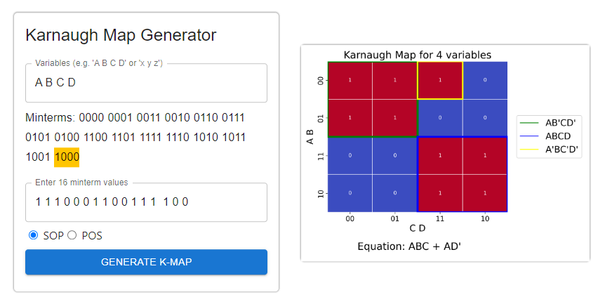

# 🗺️ Karnaugh Map Generator

This is a simple Karnaugh Map generator written in Python. It takes a boolean expression and generates a Karnaugh Map for it. It also generates the simplified boolean expression from the Karnaugh Map.

## Usage
Make sure React App is built.
```bash
cd frontend
npm run build
```

Run the server.
```bash
uvicorn main:app --reload
```

## Deployment with Phusion Passenger
```bash
#!/bin/bash

# Remove old repo
rm -rf kmap-generator

# Make new folder
mkdir kmap-generator

# Clone repo to server
git clone https://github.com/judahpaul16/kmap-generator.git

## Backend
# Create/activate virtual environment
python3 -m venv env
source env/bin/activate

# Install python modules
cd kmap-generator
pip install --upgrade pip
pip install -r requirements.txt

## Frontend
# Build the app
cd frontend
npm i
npm run build
cd ..

# Restart Phusion Passenger service
mkdir -p tmp
touch ./tmp/restart.txt
```
--- 



### Live at [judahpaul.com/kmap-gen](https://judahpaul.com/kmap-gen)
